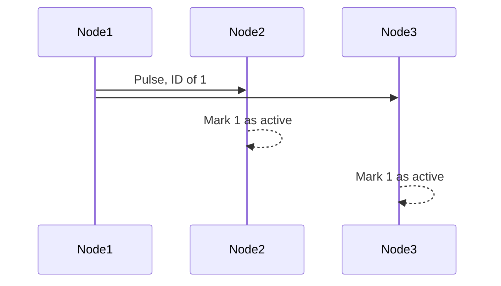
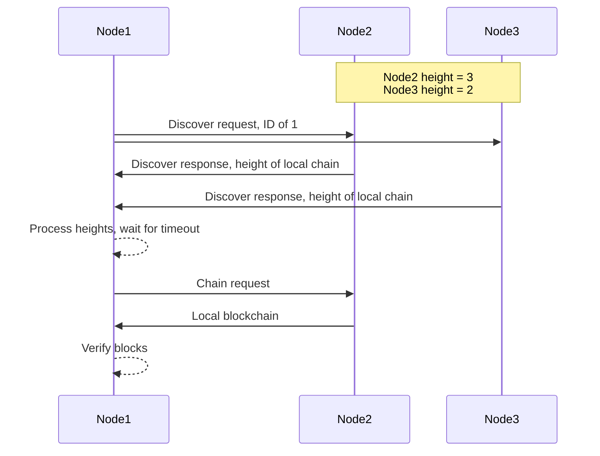
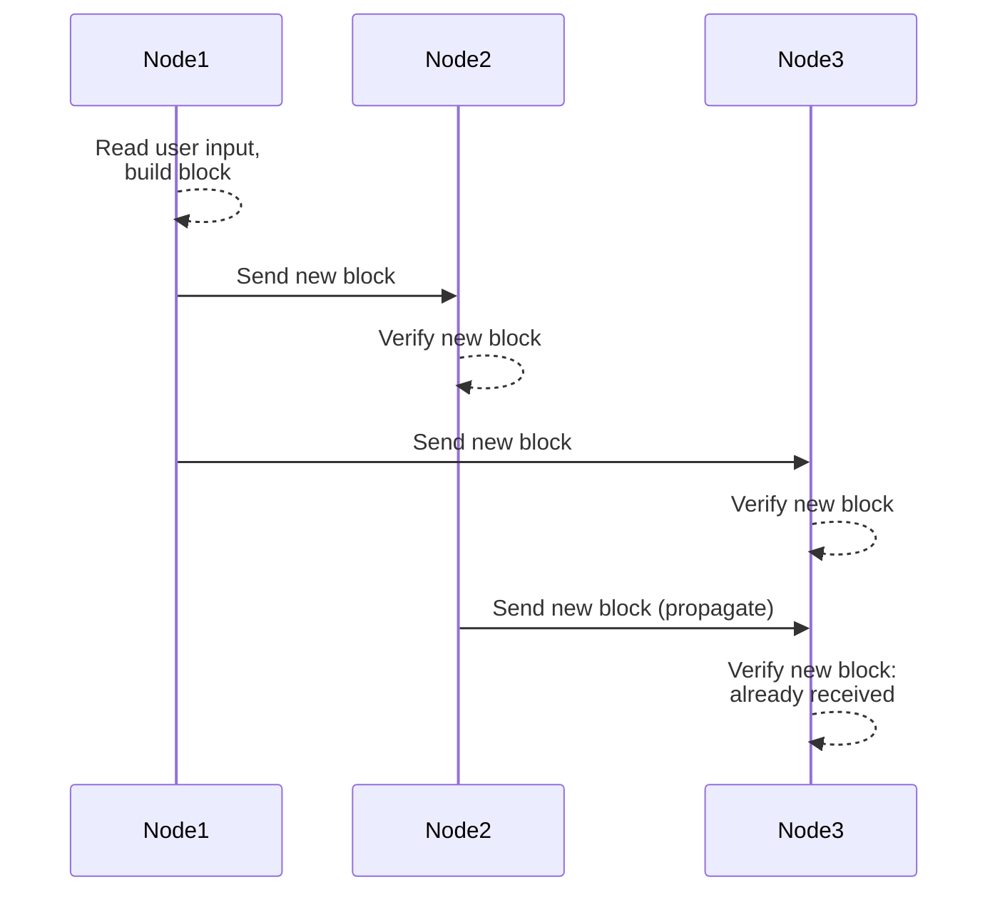
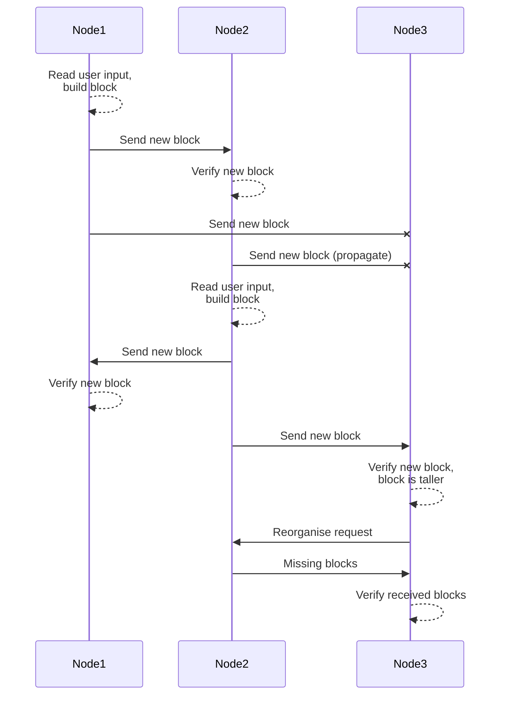

# CAN Blockchain
Authored by Ty Paragas  
Submitted for April 9th, 2026  

## Compiling and Running
Navigate to the root directory of the project and use the command `make debug` to compile. Install the code on each microcontroller with the compiled code using the command `make app-install`.

Flash parameter bytes are organized as follows:
node ID, starting node boolean, display available boolean, secret key[0], secret key[1], secret key [2], secret key[3]

## 1 Design

### 1.1 CAN Driver

#### 1.1.1 A General Driver
When writing the CAN driver, I wanted to try and make it as general as possible, while still including functionality that supported my application. 

Initially, I defined transmit buffer and extended filter structs, each with a 32-bit ID field represented by a `uint32_t` variable. I built the IDs within the CAN driver by passing in the information I wanted to include in to a method defined in the CAN interface. I realized that constructing IDs this way heavily coupled my app with the driver, so I changed the ID variable type in each of the previously mentioned structs to a `uint8_t` array of size 4. This allowed me to build the IDs in the app code instead and pass a completed struct to the driver to update the message RAM.

The driver is also limited in some ways, while overdesigned in others. My implementation only allows the setup of TX buffers and RX FIFOs, and only allows the use of extended message IDs. The choice to limit the driver this way was just to keep it simple and provide essential functionality for communication. One place where it isn't as simple as it could be is that the drivers allows the setup of two RX FIFOs, even though my application only makes use of one, but the addition of this option in the initialization of the driver was trivial so I added it anyways.

#### 1.1.2 Interrupt-driven vs Scheduled Message Processing
I initially implemented the receipt of messages asynchronously, drawing heavy inspiration from how we did message processing in the assignments. This worked for a bit while testing, but I discovered that if I wanted to have decent fault tolerance in my nodes, I needed message processing to be on a schedule, otherwise nodes could get stuck in an invalid state forever if no other messages were sent to it. Considering this, I changed my message processing implementation to a state machine with a scheduled processing task that calls a receive method given in the CAN driver interface and checks if the indicated RX FIFO has any new contents. By implementing message processing as a state machine, I was able to implement timeouts in appropriate places by adding per-state counts that increment on each process of the state machine, allowing a node to return to an idle state if it never receives the remaining bytes of a message.

Doing message processing this way also allowed me to reduce the complexity of the callback function I was providing to the CAN driver on startup. Before, the app would receive a message from the driver in the callback as a parameter and then call a helper function that processes messages of the type received. Receiving messages this way allowed me to process different types of messages "at the same time", but forced me to manage separate state for each message type (since each one represents a different sequence of messages). This was way too messy and introduced a ton of bugs and race conditions into my code that were easily solved by moving everything to a single state machine. The callback itself was reduced to incrementing a counter representing the number of messages in the FIFO.

### 1.2 Messaging Protocol

#### 1.2.1 Broadcast vs Propagation
Because broadcast is possible over CAN, it seemed like the go-to choice for sending out blocks. However, by broadcasting new blocks, any nodes who weren't ready to receive a new block (because of being in an invalid state causing the node to skip receiving the bytes from the network) would never get the new block and would be forced to reorganise their chains when they did receive another block from the longer chain. By switching to block propagation (e.g. targetting the block bytes to only a few neighbouring nodes when sending out a new block), this would give nodes who weren't ready the first time a potential second chance at staying up-to-date with the rest of the network. This only minimizes the chance of this issue occuring though, as nodes could potentially miss several propagation attempts from other nodes if they were somehow not in a state to receive any of the propagated blocks at the time they were sent.

#### 1.2.2 Message Design
Each type of 'request' over the network has its own message type that is set in each packet. There is also a specific type that indicates that a packet is a part of a block being sent. The different header types are used to differentiate different steps in a message flow. These headers are also used to indicate what type of block packet is being sent for additional clarity of messages (e.g. indicating if a block is part of a new block or a block in an existing chain).

The type, header, sender ID, and receiver ID are set in specific parts of a message's ID. The ID of a message is parsed as an array of bytes, rather than a 4 byte uint so that the additional information of the message is easier to be parsed.

#### 1.2.3 Handshaking
In my initial implementation, almost everything that wasn't a pulse was done with a handshake. I did this because I was scared of communications being inconsistent/moving to fast and having to deal with many dropped messages, but I realized I was dealing with more communications issues with handshaking, as sometimes the handshake messages would get lost (due to my hardware setup which was quite bad with all the unnecessary wires). Combining this with the fact that I wasn't saving much state with the communications at the time meant I didn't really have a way to recover from those errors. I eventually decided to lose the handshakes and instead go with an indicator message that will allow the node being communicated with to prepare for the incoming messages without any response to the indicator. I tested this out and realized it actually worked quite well and I found that fewer messages were getting lost compared to using handshakes. At this point, I also added more state to the communications so that I could timeout if nothing was received after the indicator, allowing the nodes to be reset to an idle state rather than staying blocked.

### 1.3 Digital Signatures
The messages for the blockchain are signed using an HMAC implementation that uses SHA256 as the encryption algorithm. The shared private key for network communication should be set in the flash parameters of each node, as outlined in the section Compiling and Running. This was implemented just for fun but also adds to the network security of the blockchain (i think).

## 2 Source Code Organization

### 2.1 `/app`
Contains source code specific to the blockchain application.

#### 2.1.1 `blockchain.c/.h`
- Contains structs, enums, macros, function pointer aliases, and functions specific to the blockchain application.
  - Includes blockchain init, block verification, and block signing.

#### 2.1.2 `display.c/.h`
- Implements a display driver. This code is a modified version of the display driver provided in our assignments.
  - Adds additional fonts (English letters + colon).

#### 2.1.3 `hmac.c/.h`
- Implements a keyed-hash message authentication code according to standards defined in RFC 2104 (i think).
- Depends on the ICM driver and the SHA256 functionality it provides.

#### 2.1.4 `morse_map.c/.h`
- Implements an interface used to convert a binary string to a morse code string made up of '-' and '.' characters.

#### 2.1.5 `net.h`
- Includes enums for network message/header types and macros for ID indexing.

#### 2.1.6 `main.c`
- Implements the application code.
- Handles state machines, utils, helpers, and app display.

### 2.2 `/drivers`
Contains device drivers.

#### 2.2.1 `can.c`
- Contains my CAN driver implementation.

#### 2.2.2 `dcc_stdio.c`
- Provided code that implements debug write functionality.

#### 2.2.3 `heart.c`
- Implements SysTick driver. Largely taken from the provided `heart.c` source file used in our assignments.

#### 2.2.4 `icm.c`
- Contains my ICM driver implementation. Used only as a SHA256 engine.

#### 2.2.5 `spi.c`
- Provided code that implements an SPI driver.

#### 2.2.6 `trng.c`
- Contains my TRNG driver implementation.

### 2.3 `/include`
Contains interfaces for drivers.

## 3 Application State Management
All application state is managed using 3 state machines: Rx, Tx, and Prop, used for receiving messages, reading user input, and propagating blocks. Initially, I only had the Rx and Tx state machines and broadcasted new blocks in a state in the Tx state machine, but when I switched to propagation, I found it easier to just make a whole new state machine specific to that operation rather than trying to fit it into the Tx state machine. This also allowed the nodes to continue to receive/send messages like pulses or discovery requests while propagating a new block.

### 3.1 Rx state machine
The Rx state machine has 5 states: Entry, Discover Send, Discover Receive, Chain, and Reorganise. Processing this state machine receives the next message in the message FIFO.

#### 3.1.1 Entry
This serves as the initial/idle state for this state machine. It calls some of the other Rx state machine methods to process the received message before transitioning to the state outputted from processing.

#### 3.1.2 Discover Send
This state is used only to broadcast discovery requests on node startup and for chain reorganisation

#### 3.1.3 Discover Receive
This state is used to receive and respond to discovery requests. After receiving discovery responses and determining the longest chain, the state machine transitions to the Chain state.

#### 3.1.4 Chain
This state processes chain requests, receives chain blocks, and sends chain blocks after the discovery handshake is completed. When a node sends their blockchain, the sending operation blocks while sending, and then transitions back to the entry state.

#### 3.1.5 Reoganise
This state is used to process reorganise requests, which asks another node for all blocks on their blockchain after a certain height. This process is done so that a node can catch up with the rest of the network if their blockchain is behind. This state transitions to Discovery Send if an error occurs while receiving the intermediate blocks.

### 3.2 Tx state machine
The Tx state machine has 4 states: Idle, Read, Convert, and Transmit. Processing this state machine reads input from the processor card button and coverts it to morse code before transmitting a new block.

#### 3.2.1 Idle
This state handles blinking the processor card LED to indicate that the application is ready to process input, and transitions to the Read state if user input is detected.

#### 3.2.2 Read
This state reads morse code from user input and builds a morse code string to be converted into an English character. In this state, the processor card LED will activate when the user presses the processor card button. Once the user input reaches the max binary string length or the input timeout is triggered, a transition to the Convert state will occur.

#### 3.2.3 Convert
This state converts an array of morse code characters and converts it into an English character before transitioning back to the Read state.

#### 3.2.4 Transmit
This state will take the converted English string and build and sign a transaction using the string before placing this transaction into a block to be transmitted. The state machine will remain in this state if another new block is being transmitted at the time the Transmit state is entered.

### 3.3 Prop
This state machine contains 2 states: Idle and Send. Processing this state machine will prepare an array of peers to choose from before propagating the block at the top of the blockchain.

#### 3.3.1 Idle
If a new block is to be sent, this state goes through the known active peers and prepares a condensed array to choose from for propagation before transitioning to the Send state.

#### 3.3.2 Send
This state will choose a peer from the condensed array and transmit the new block to them each time the state machine is processed, until either no more peers are left to be sent to, or the max number of peer to propagate to has been reached.

## 4 Message Sequences
The following are high-level sequence diagrams that outline some message sequences that occur between 3 nodes. These sequence diagrams can be rendered on the online Mermaid viewer.  
Broadcast messages are consecutive arrows.

### 4.1 Pulse

### 4.2 Discovery and chain transmission

### 4.3 Sending/Receiving a new block

### 4.4 Chain reorganisation
